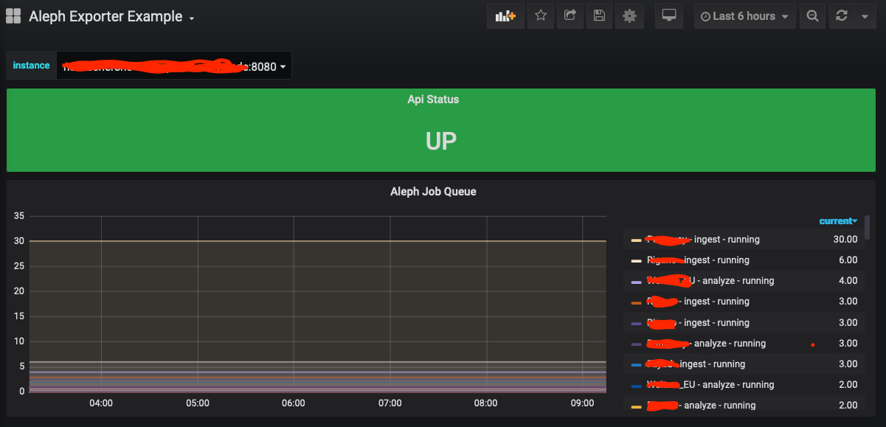

# aleph-exporter


Exposes some metrics from the aleph api (https://github.com/alephdata/aleph) as prometheus metrics.

## Test
`make test`

## RUN
```
./aleph-exporter --aleph-host some-host-running-aleph-api --aleph-token "some-token"`
```

## Docker

```
docker run --rm -p 8080:8080 -e ALEPH_HOST=$ALEPH_HOST -e ALEPH_TOKEN=$ALEPH_TOKEN ckluenter/alephexporter
```

## Grafana
There is an example dashboard in [contrib](contrib/)